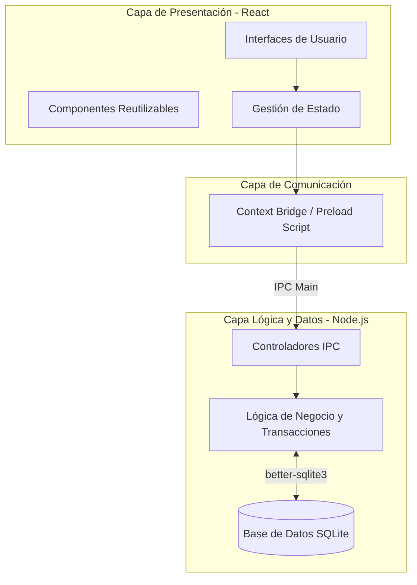
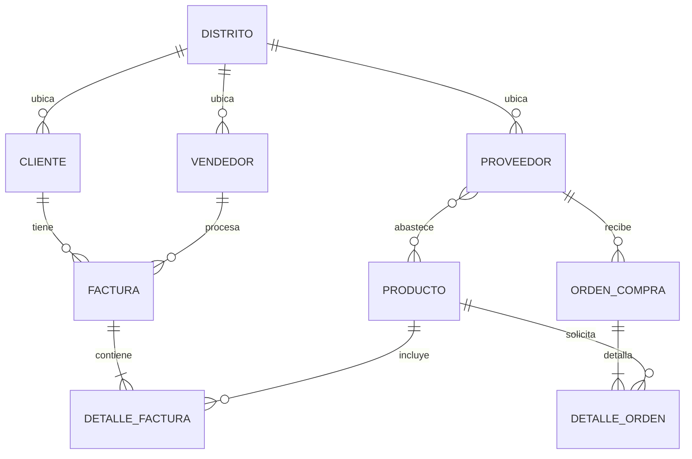

# SISTEMA_SALES S.A. - Sistema Híbrido de Gestión Empresarial

  

## 📌 Descripción General

**SISTEMA_SALES** es una aplicación de escritorio multiplataforma diseñada para unificar, centralizar y automatizar los procesos operativos críticos de una empresa: **Ventas, Facturación, Control de Inventario y Abastecimiento**. 

El sistema reemplaza los procesos manuales y hojas de cálculo fragmentadas mediante una solución unificada que garantiza la integridad de los datos mediante transacciones ACID locales, sin necesidad de infraestructura de servidores externos ni conexión a internet obligatoria.

---

## 🏛️ Arquitectura Técnica

El sistema ha sido construido utilizando una **Arquitectura de Capas Híbrida**, embebiendo tecnologías web modernas dentro de un contenedor nativo de escritorio.



### Componentes del Stack
1. **Frontend (React 19 + TypeScript + Vite):** Proporciona una interfaz reactiva, construida con componentes modulares y tipado estricto. La compilación se optimiza mediante Vite.
2. **Contenedor (Electron):** Permite el acceso nativo al sistema operativo. Se ha configurado con `contextIsolation` activado, separando estrictamente el hilo de renderizado del hilo principal (Node.js) por motivos de seguridad.
3. **Backend Local (Node.js):** Estructurado bajo el patrón **MVC (Modelo-Vista-Controlador)**. Los controladores exponen las funciones a través de `ipcMain`, delegando la carga a los Servicios.
4. **Persistencia (SQLite3):** A través de `better-sqlite3`, la base de datos se guarda en el directorio local del usuario (`userData`). Se implementan **transacciones atómicas (BEGIN/COMMIT/ROLLBACK)** para operaciones críticas como la facturación y actualización de stock.

---

## 💾 Esquema de Base de Datos (Modelo Relacional)

La integridad referencial está garantizada mediante restricciones `FOREIGN KEY` habilitadas nativamente (`PRAGMA foreign_keys = ON`).



---

## 🚀 Guía de Instalación y Clonación (Especial para Windows)

Dado que la base de datos utiliza una librería nativa escrita en C++ (`better-sqlite3`), el proceso de compilación varía según el sistema operativo. **Siga estas instrucciones si está en Windows:**

### 1. Requisitos Previos
- **Node.js**: Versión estable (LTS) recomendada v20 o v22. (Evite usar la v26 si su sistema no posee las herramientas de compilación de Visual Studio).
- **Git** instalado en el sistema.

### 2. Clonación del Repositorio
Abre tu terminal nativa (**CMD** o **PowerShell** en Windows) y ejecuta:
```cmd
git clone https://github.com/snxz-dev/sistema-sales.git
cd sistema-sales
```

### 3. Instalación de Dependencias
⚠️ **CRÍTICO:** Ejecute la instalación *exclusivamente desde la terminal nativa de Windows* (no utilice WSL para este paso si su intención final es generar un `.exe` de Windows).
```cmd
npm install
```

### 4. Ejecución en Modo Desarrollo
Para iniciar la aplicación, compilar el frontend y levantar el proceso principal de Electron:
```cmd
npm run dev
```

---

## 📦 Empaquetado para Producción

Para generar el instalador distribuible (el archivo `.exe` para Windows o `.AppImage` para Linux):
```cmd
npm run package
```
Los ejecutables generados se encontrarán en la carpeta `/release/`.

---
*Desarrollado como proyecto de Titulación por SISTEMA_SALES.*
