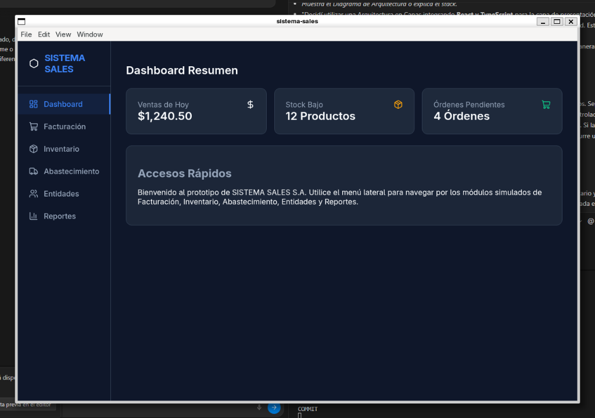
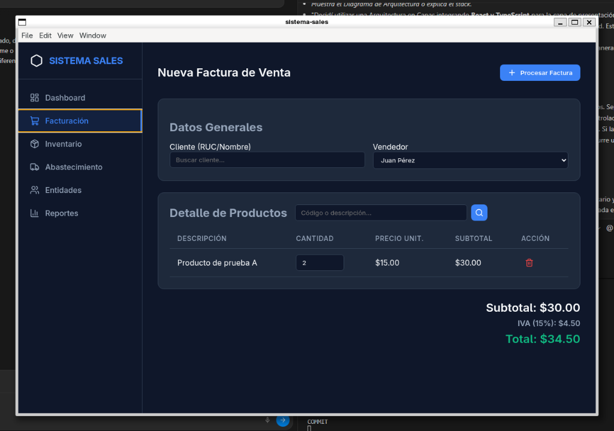
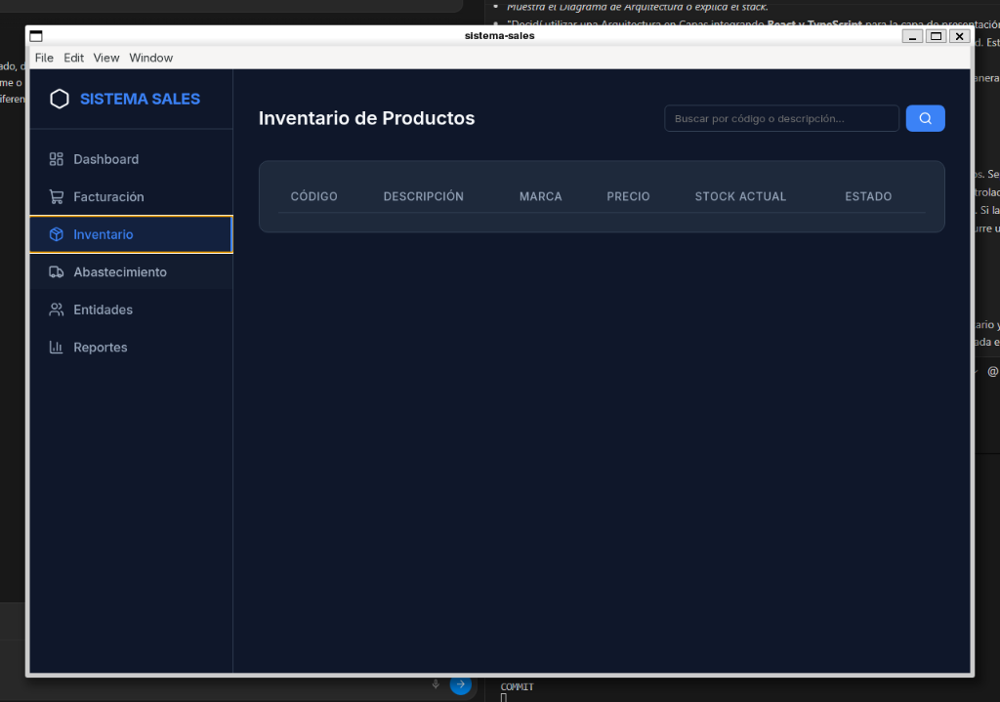
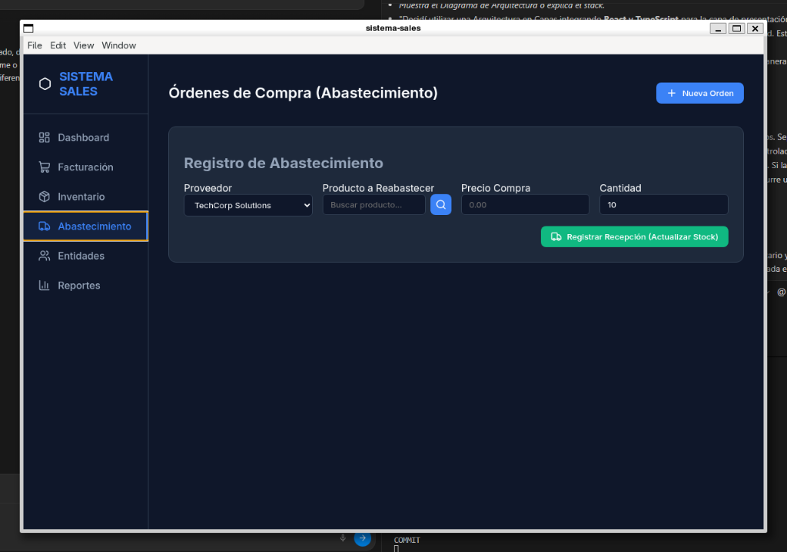
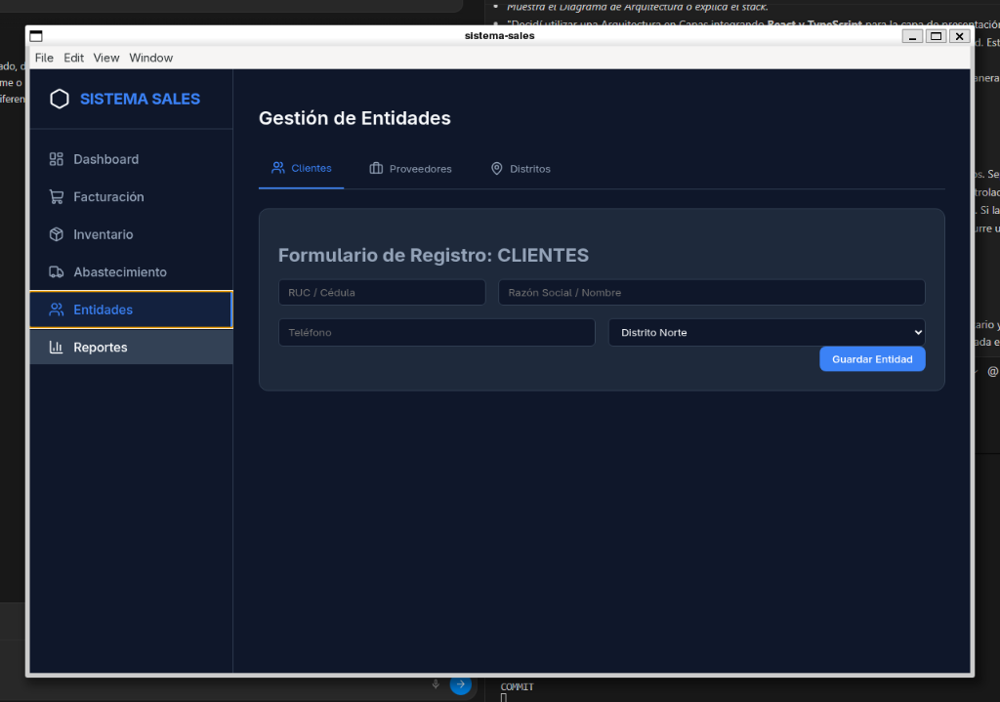

# SISTEMA_SALES S.A. - Sistema de Gestión Empresarial Híbrido


## 📌 Descripción del Proyecto

SISTEMA_SALES es una aplicación de escritorio integral desarrollada como proyecto académico de titulación. Está diseñada para unificar, centralizar y automatizar los procesos operativos críticos de una mediana empresa comercial, eliminando la dependencia de hojas de cálculo fragmentadas y procesos manuales.

### Problema que resuelve
Las pequeñas y medianas empresas comerciales a menudo sufren de un manejo ineficiente de su inventario, ventas y compras. La desconexión entre la facturación y el almacén produce desfases de stock, ventas de productos inexistentes y pérdida de información crítica. Este sistema unifica todos los departamentos en una sola fuente de la verdad.

### Características Principales
- **Punto de Venta (Facturación):** Emisión de facturas con cálculo automático de IVA y validación en tiempo real de stock disponible.
- **Control de Inventario:** Descuento automático de stock al facturar.
- **Abastecimiento:** Generación de órdenes de compra a proveedores.
- **Directorio Centralizado:** Gestión relacional de Clientes, Proveedores y Vendedores, organizados por distritos geográficos.
- **Integridad Transaccional (ACID):** Rollbacks automáticos ante errores de inserción, asegurando que el inventario jamás se corrompa por una venta a medias.
- **Despliegue Local Seguro:** Base de datos embebida que no requiere conexión a internet para operar.

---

## 📸 Interfaz de Usuario

A continuación se presenta la interfaz gráfica del sistema, renderizada nativamente mediante Electron y estilizada con CSS Modules.

### 1. Panel de Control (Dashboard)


### 2. Módulo de Facturación (Punto de Venta)


### 3. Módulo de Inventario


### 4. Módulo de Abastecimiento (Órdenes de Compra)


### 5. Gestión de Entidades (Clientes, Proveedores, Distritos)


---

## 🛠 Tecnologías Utilizadas

Este proyecto implementa una arquitectura híbrida de última generación, encapsulando tecnologías web dentro de un entorno nativo:

- **Frontend:** React 19, TypeScript, Vite, CSS Modules.
- **Motor de Escritorio:** Electron.
- **Backend Integrado:** Node.js (Main Process).
- **Base de Datos:** SQLite3 (mediante el driver sincrónico `better-sqlite3`).
- **Empaquetado:** `electron-builder` configurado en el `package.json`.

---

## 🏛 Arquitectura del Sistema

SISTEMA_SALES aplica una estricta arquitectura Modelo-Vista-Controlador (MVC) y una separación de contextos (*Context Isolation*).

1. **React (Vista):** El usuario interactúa con la interfaz gráfica. Los hooks envían solicitudes a través de una API expuesta globalmente.
2. **Context Bridge (Preload):** Intermediario seguro que expone únicamente los métodos necesarios del backend, bloqueando el acceso directo al sistema de archivos desde la vista.
3. **IPC (Controladores):** Node.js escucha los eventos (`ipcMain.handle`). Al recibir una orden de "Facturar", delega la responsabilidad a los Servicios.
4. **Services (Lógica de Negocio):** Se inicia una transacción SQLite. Se validan las reglas de negocio (ej. "el stock debe ser > 0").
5. **Repositories:** Ejecutan el código SQL directamente contra la base de datos `better-sqlite3`.

---

## 💾 Ubicación de la Base de Datos

La base de datos SQLite no reside en la carpeta del código fuente por motivos de seguridad y persistencia. En su lugar, el sistema la aloja automáticamente en la carpeta oficial de datos de usuario del sistema operativo (`userData`).
- **Windows:** `%APPDATA%\sistema-sales\database.sqlite`
- **Linux:** `~/.config/sistema-sales/database.sqlite`

---

## ⚙️ Guía de Instalación y Despliegue

### Requisitos Previos
- Node.js LTS (v20 o v22 recomendado).
- Git.
- (Solo para Windows) *Herramientas de compilación de C++ de Visual Studio* si se requiere compilar dependencias nativas desde cero.

### 1. Instalación (Desarrollo)
```bash
# Clonar el repositorio
git clone https://github.com/snxz-dev/sistema-sales.git
cd sistema-sales

# Instalar dependencias nativas
npm install
```
*Nota para usuarios de Windows:* Ejecute `npm install` estrictamente desde la consola de Windows (CMD o PowerShell) para garantizar la correcta compilación de los binarios de SQLite para su plataforma.

### 2. Ejecución (Entorno de Desarrollo)
Inicia Vite y el proceso de Electron simultáneamente:
```bash
npm run dev
```

### 3. Compilación y Generación del .exe
Para construir la versión de producción optimizada y generar el instalador distribuible:
```bash
npm run package
```
El instalador generado se almacenará automáticamente en el directorio `/release/`.

---

## 📂 Estructura del Proyecto

```text
sistema-sales/
├── electron/                 # Lógica nativa de Backend (Node.js)
│   ├── controllers/          # Receptores de eventos IPC
│   ├── database/             # Conexión y configuración SQLite
│   ├── repositories/         # Accesos directos SQL
│   ├── services/             # Lógica de negocio y Transacciones
│   ├── main.ts               # Punto de entrada de Electron
│   └── preload.ts            # Context Bridge (Seguridad)
├── src/                      # Frontend (React)
│   ├── pages/                # Vistas de Módulos (Ventas, Inventario)
│   └── main.tsx              # Punto de entrada React
├── package.json              # Scripts y metadatos de electron-builder
└── vite.config.ts            # Configuración de compilación externa
```

---

## 🔐 Seguridad y Control

1. **Aislamiento de Contexto:** `nodeIntegration` desactivado por defecto. El frontend jamás toca el disco duro directamente.
2. **Consultas Parametrizadas:** Todas las consultas SQL (`stmt.run`, `stmt.all`) utilizan binding (`?`) por defecto a través de `better-sqlite3`, neutralizando vulnerabilidades de inyección SQL.

---

## 📜 Licencia y Autoría
Desarrollado estrictamente con fines académicos y de titulación por el equipo de **SISTEMA_SALES**.
